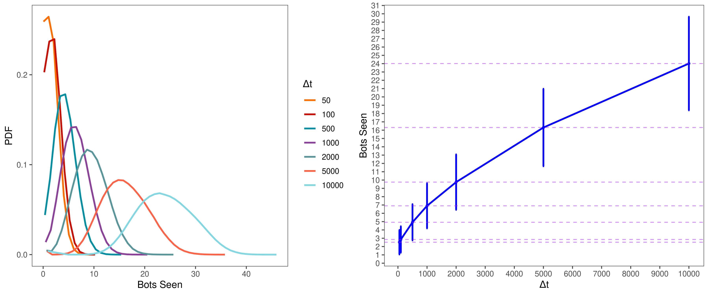
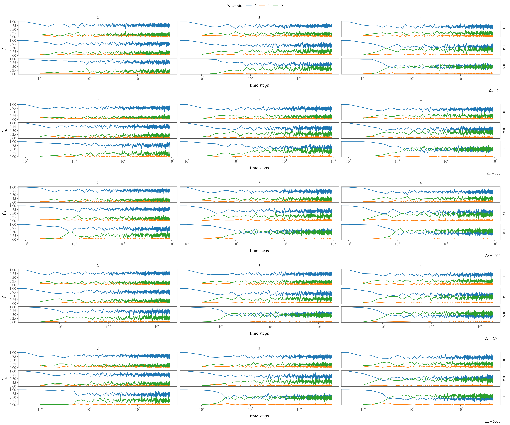
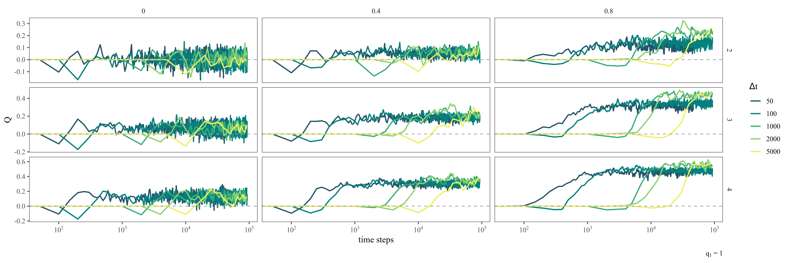
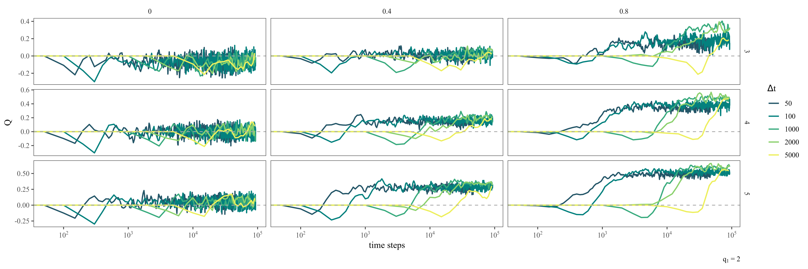
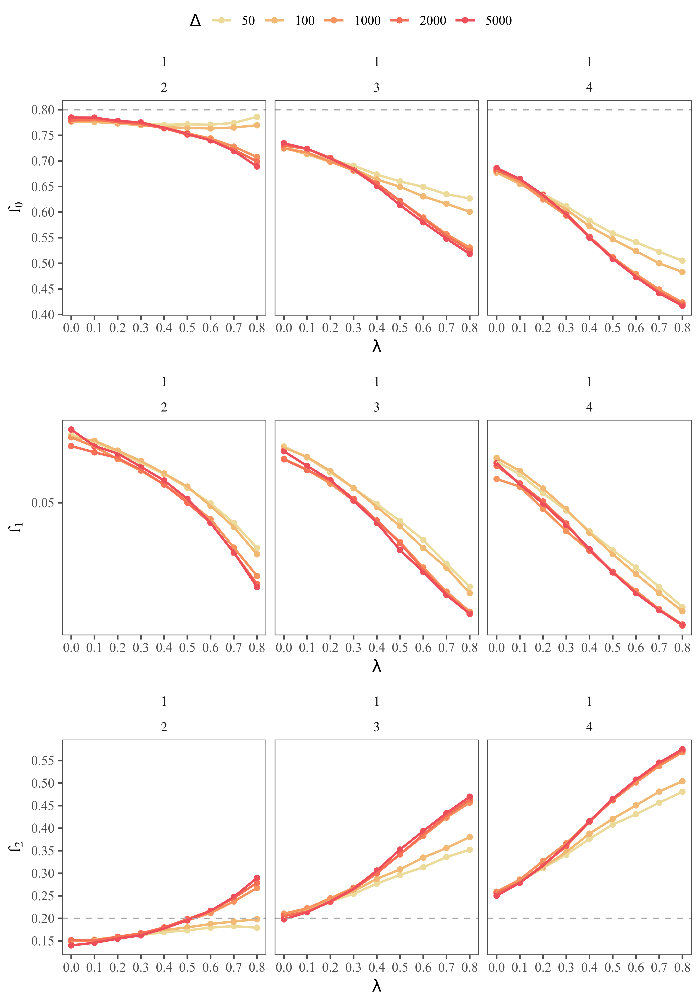
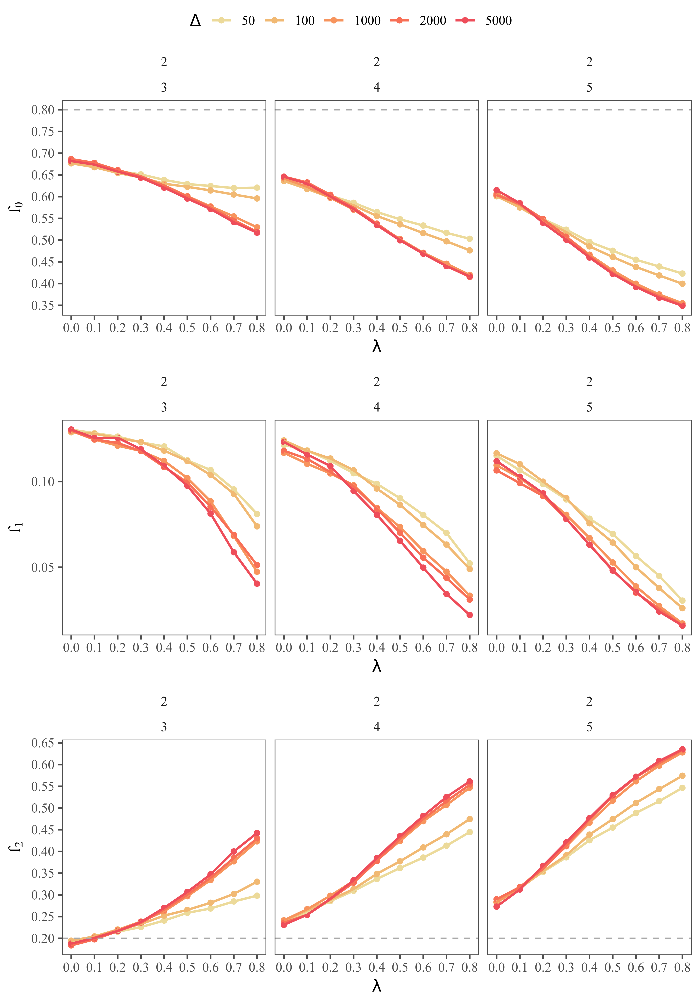
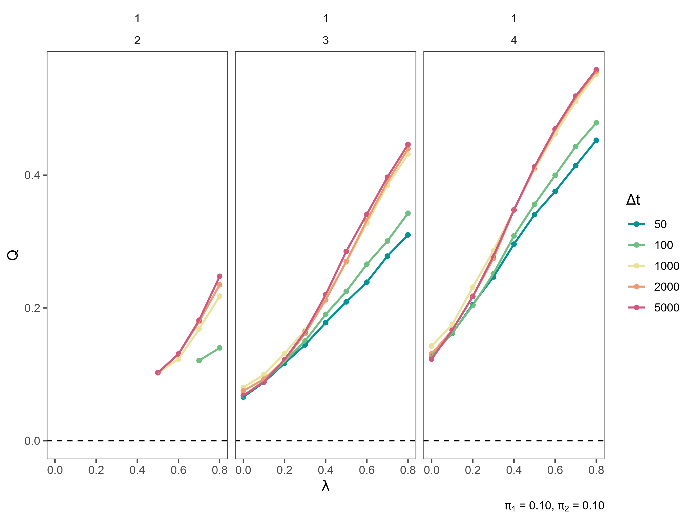
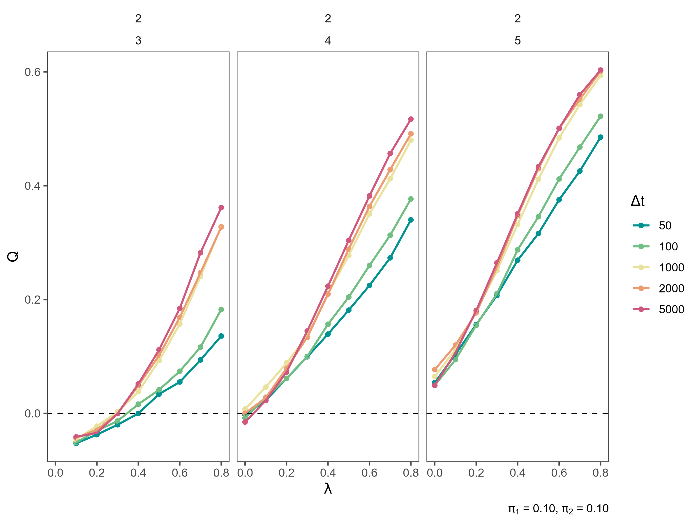

# KILOMBO RESULTS

## Model conditions

- *a priori* probabilities $\pi_1, \pi_2$:
- Site qualities $q_1, q_2$

- Interdependence $\lambda$

- Exploration time $\Delta t$:

- N = 50

## 1. Bots seen

- The longer the exploration time, the higher the mean and standard deviation.

## 2. Dance frequencies as a function of time

#### Effect of quality of good site, $q_2$:
- The frequency of bots dancing for site two increases while bots not dancing decreases.
- Frequency of bots dancing for site one decreases with higher values of $q_2$.  

#### Effect of interdependence, $\lambda$
- Increasing interdependence also causes an increase in $f_2$ and a decrease in $f_0$ and $f_1$.
- At $\lambda = 0$, $f_0$ is higher than $f_2$ in all conditions.

#### Effect of exploration times
- Shorter $\Delta t$ reach stationary state faster.
- $f_2$ reaches higher values for Longer $\Delta t$.

 **Figure 2**. Dance frequencies as a function of time for $q_1=1$ and $q_2 = {2,3,4}$, $\lambda = 0, 0.4, 0.8$ and $\Delta t = 50, 100, 1000, 2000, 5000$.

**Figure 3**. Dance frequencies as a function of time for $q_1=2$ and $q_2 = {3,4,5}$, $\lambda = 0, 0.4, 0.8$ and $\Delta t = 50, 100, 1000, 2000, 5000$.

## 3. Consensus as a function of time
**Definition of consensus:**
$Q = f_2 - 2f_1$

## 4. Stationary dance frequencies

Stationary dance frequencies as a function of interdependence, for $q_1=1$ and $q_2 = {2,3,4}$, $\lambda = 0, 0.4, 0.8$ and $\Delta t = 50, 100, 1000, 2000, 5000$

Stationary dance frequencies as a function of interdependence, for $q_1=2$ and $q_2 = {3,4,5}$, $\lambda = 0, 0.4, 0.8$ and $\Delta t = 50, 100, 1000, 2000, 5000$
## 5. Stationary consensus

## Main conclusions
- For all conditions, it takes a little longer than $10 \Delta t$ cycles to reach stationary $Q$. Again, we need to decide a method for measuring time to consensus to be able to say if different $\lambda$ and dance times significantly affect time to consensus reaching.

- $Q$ reaches higher values as $q_1-q_2$ ratio increases.

- Shorter $\Delta t$ reach consensus sooner.

- Higher $\lambda$ have a greater effect in dance frequencies and $Q$ values differences between $\Delta t$
- Consensus reaching, both in speed and strength, is not significantly different for $\Delta t = 1000$, $\Delta t = 2000$ time steps.
- Stationary $Q$ is similar from $\Delta t >= 1000$.
- Stationary $Q$ as a function of $\lambda$ for different $q_1$ (with corresponding $q_2$) shows a different behavior. For $q_1 = 1$, consensus is reached for all $\lambda$ values. For $q_1 = 2$, the line is steeper, which results in consensus not being reached or being very low for low $\lambda$, but reaching higher values for high $\lambda$. This behavior is due to an increase in $f_1$ for $q_1 = 2$ greater than the decrease and increase in $f_0$ and $f_2$, respectively.
