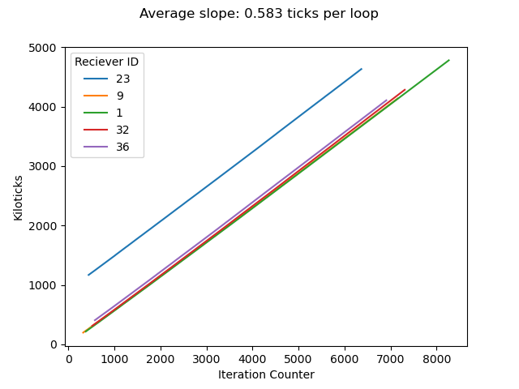

# Protocolo experimental en Kilobots

## Antes de empezar

1. **Asegurarse que todos tengan ID**:
   Iniciar el script *id_debug.hex*. Los kilobots encenderán la luz si tienen un ID $\mod 10$, i.e. el bot con ID = 1 encenderá del mismo color que el ID 11, 21, 31 y 41. Si no enciende luz, es que no tiene ID.
2. **Patas de kilobots rectas**:
   Utilizar el aparato 3D printed.

3. **Comprobar que los kilobots estén calibrados**
   Iniciar el script *go_straight.hex*. Se considera que un bot está calibrado si pueden ir recto 15 cm, en una anchura de 7.5 cm.
   Calibrar a los kilobots que se necesite con base en los valores de la tabla:
    https://docs.google.com/spreadsheets/d/1lLEAYlaw0cSjxO7ze2P7xQTy3PDm-wXrka6_WbAYmzk/edit#gid=1138819062.
   Si estos valores no aseguran ir recto, modificarlos y documentarlo en la tabla.

## Pruebas

### 1. Cuántos mensajes reciben por segundo

script: messages.hex

#### Protocolo

1. Conectar cable debugging a kilobot, abrir "Serial .." en KiloGUI.
2. Aparecerá el número de mensajes recibidos y los kiloticks.
3. Número de vecinos de 1 a 10.

### 2. Bots Vistos
script: unique_bots_seen.c
1. Bot emite un mensaje con su ID
2. Bot recibe mensajes con ID.
3. Si es la primera vez que recibe ese ID, guarda ID en vector y sumas 1 a variable de bots vistos.
4. Si recibe un mensaje con el mismo ID, no hace nada.
5. Dependiendo de número de bots vistos, enciende led:
  - 0: no luz
  - 1-3 luz verde
  - 4-6 luz azul
  - 7-10 luz roja
  - 11 en adelante: luz morada

#### 2.1. Bots vistos en $\Delta t$
script: Unique_bots_seen_Deltat.c

1. Random walk
2. Bot emite un mensaje con su ID
3. Bot recibe mensajes con ID,
4. Si es la primera vez que recibe ese ID, guardas ID en vector y sumas 1 a variable de bots vistos.
5. Si recibe un mensaje con el mismo ID, no hace nada.
6. En $\Delta t$, dependiendo de número de bots vistos, enciende led de un color (luces/intervalos dependientes de $\Delta t$) y se detiene.
7. Se toma fotografía del estado final.

### 3. Desincronización temporal entre bots

### 4. Random walk tests

script: random_motion.hex

Los vídeos pueden ser vistos aquí:

https://mega.nz/folder/3GgwDIAD#aVKxpuHiPXFEw4ke6cx-Jg

## NOTAS 11 DE NOVIEMBRE 2021

1. Problema de sincronización
- Medir a qué altura los kilobots reciben el infrarrojo de otro kilobot: a qué distancia habría que colgar.
- Para no acumular desfase, probar si hay un desfase constante en los procesadores, y si es así.

# Próxima reunión:
1. Probar con el material de allá.
1. Explicar cómo estoy midiendo los Delta t.
2. Ver el efecto de un kilobot que resetee el reloj para todos.
3. Ver el efecto que cuatro kilobots en cuadrantes de medio.
4. Cuántos bots ven en Delta_t, para varios Delta_t.
5. Arena pequeña: 20 cm de radio. Hacer vídeos con esta arena y condición PRW-angulos discretos.
6. Modelo de inmóviles con kilombo: mismos vecinos.

## Cuánto tiempo pasa en cada loop

Evolución de los kiloticks con las iteraciones del loop: la evolución es lineal con un pendiente de aprox 0.58

$kilo ticks = 0.58*iteration$

| kiloticks | iterations |
| --------- | ---------- |
| 100       | 172.41     |
| 500       | 862        |
| 1000      | 1724.1     |
| 5000      | 8620.6     |

## Iteraciones transcurridas entre mensajes

$ReceivedMessage =  0.3to0.5*iteration^{-1}$

### INFORMACIÓN DE MENSAJES

Both the transmitter and receiver have an isotropic emission or reception pattern, which allow the robot to receive messages equally from all directions.

**message_t *tx_message()**
Callback for message transmission.

This callback is triggered every time a message is scheduled for transmission (roughly twice every second).

Kilobot can communicate at rates up to 30 kb/s
With all robots using the same infrared channel for
communication, there is the possibility that two or more
robots may try to transmit at the same time. To mitigate
this problem a standard carrier sense multiple access with
collision avoidance (CSMA/CA) method is used.

In an experiment with 25 robots, configured as shown in Fig. 2, the channel could support on average 240 five-byte packets/second, a 32% channel usage.

Infrarred:  up to 7cm, up to 32kb/s  and 1kbyte/s with  25 robots, serial (256000 baud)

1024 bytes = 1 KB (kilobytes).

## Pruebas 25/11/2021

### Subir el vidrio para ver si aumenta el área de comunicación

#### CONDICIONES

- Oscuridad
- Dos alturas del vidrio
- 21 kilobots por altura.
- Infrarrojo hacia arriba

#### PROTOCOLO
- Poner beacon en el centro, debajo del cristal
- Medir la distancia máxima a la que llega la señal de sincronización
- Anotar la distancia en una tabla.

### Tiempo en loops en lugar de en kilo ticks

Elegir la altura de vidrio.
Hacer pruebas de sincronización a partir de loops para delta_t ~ 100, 1000, 5000 ticks

### Bots vistos en delta t ~ 100, 1000, 5000 ticks

## PRUEBAS 02/DICIEMBRE/2021

3. Modelo ya en marcha, pero que la luz marque la sincronización. Contando el tiempo de 256 ciclos. 200 iteraciones.
   3.1. Contabilizar cuántos se pierden uno o dos ciclos:
   - Contabilizar el periodo en segundos, del beacon para 200 iteraciones
Por alguna razón, de 0.24 pasa a 0. Ej, 1.23, 1.24, 2.00. Por esto hay que restar .76 a todos los cálculos.

**Extract image every x frames**
g -i test.mp4 -vf "select=not(mod(n\,97))" -vsync vfr -q:v 2 images/RGB/out%3d.jpg

ffmpeg -i test.mp4 -vf "select=not(mod(n\,(96 + round(random(0,2)))))" -vsync vfr -q:v 2 images/RGB/out%3d.jpg

ffmpeg -i inVideo.mp4
  -vf "select='between(t,30,30.5)+between(t,45,45.5)+between(t,73,73.5)'"
  -s 320x240 -vsync 0 out%d.png

select='eq(n\,100)+eq(n\,184)+eq(n\,213)'

**Count number of frames in video**
  ffprobe -v error -select_streams v:0 -count_packets -show_entries stream=nb_read_packets -of csv=p=0 test.mp4

This actually counts packets instead of frames but it is much faster. Result should be the same. If you want to verify by counting frames change -count_packets to -count_frames and nb_read_packets to nb_read_frames.

*What the ffprobe options mean*

  *-v error This hides "info" output (version info, etc) which makes parsing easier (but makes it harder if you ask for help since it hides important info).*

    *-count_frames Count the number of packets per stream and report it in the corresponding stream section.*

    *-select_streams v:0 Select only the first video stream.*

    *-show_entries stream=nb_read_packets Show only the entry for nb_read_frames.*

    *-of csv=p=0 sets the output formatting. In this case it hides the descriptions and only shows the value. See FFprobe Writers for info on other formats including JSON.*

| Delta_t | Mean Period (s.f) | frames (25f/s) |
| ------- | ----------------- | -------------- |
| 400     | 3.22              | 97-100         |
| 200     | 1.19              | 46-50          |
|         |                   |                |
|         |                   |                |

- Establecer un tiempo de medición en cada periodo donde se cuenta sincronización. Por ejemplo, a la mitad del periodo.
- Obtener imágenes con fps correspondientes para el tiempo de medición elegido.
- Contabilizar colores.

4. Se alcanza el estado estacionario para 256 ciclos de 200 iteraciones.
5. Bots vistos en delta_t.
6. 200-400-800 2²

Soluciones

1. Tal vez ser más redundante
2. Buscar sólo los píxeles del centro, correspondientes al beacon.
3. Estirar el led con un cable para amplificar la luz del líder.
4. Examinar si el líder es exacto en sus ciclos, si lo es, tomar directamente el número de frames por ciclo y obtener las imágenes.

Bots vistos:

Cuartiles por bots vistos, no por delta_t.

Cuartiles

hasta 12
hasta 24
hasta 25 al final

hasta 9
hasta 18
hasta   

delta t = 400 y 1600

hacer entre 250 y 500 ciclos.

## Reunión 21 diciembre de 2021
- Hacerlo a la carta o con un módulo fijo, tomar fotografías.
- Restringir N máximo a ver en bots vistos,y volver a sacar cuartiles con ese límite (por ejemplo, 20 es el máximo).

# ENERO 2022

## Por hacer, fecha límite 21/01/2022:

1. Obtener fotogramas medios en el tiempo para delta_t = 800 y 1600 (hablar con Fabian para comprar servidores).
2. Comparar resultados de bots vistos en delta_t= 400, 800, 1600 para fotogramas a la carta vs módulo fijo
3. Grabar bots vistos con cuartiles normalizados a máx bots vistos para cada delta_t.

| delta_t | percentil 1 rojo | percentil 2 verde | percentil 3 azul | Old Max Bots seen |
| ------- | ---------------- | ----------------- | ---------------- | ----------------- |
| 400     | 0-7              | 8-13              | 14-20            | 20                |
| 800     | 0-7              | 8-13              | 14-20            | 20                |
| 1600    | 0-7              | 8-13              | 14-20            | 20                |
| 3600    | 0-10             | 11-20             | 21-30            | 30                |
| 7200    | 0-10             | 11-20             | 21-30            | No hecho          |

Utilizando seis colores:

| delta_t | 1 rojo | 2 amarillo | 3 verde | 4 cyan | 5 azul | 6 magenta |
| ------- | ------ | ---------- | ------- | ------ | ------ | --------- |
| Todos   | 0-7    | 8-13       | 14-20   | 20-26  | 27-33  | 39        |

# Procedimiento de extracción de fotogramas y m conteo de blobs
Fotogramas a medida, archivo: ImageExtract_byLeaderCycleDuration.sh
Fotogramas por módulo aleatorio en rango de lider, archivo: ImageExtract_byRandMod.sh

10 fotogramas por ciclo, y sacar la derivada

# Febrero 03 de 2022

## Grabaciones

1. Cuatro vídeos de 30 min de Bots Vistos para delta t = 3200
2. Un vídeo del Modelo para delta t = 400, y delta t = 3200.

## Extracción de imágenes

**$\delta t = 400$**
ffmpeg -i BotsSeen_deltat=0400_R=03_G=06_B=09_rad=70_rep=1_part=1.mp4 -vf "select=not(mod(n\,10))" -vsync vfr -q:v 2 BotsSeen_deltat=0400_R=03_G=06_B=09_rad=70_rep=1_part=1_Images/output%04d.jpg

**$\delta t = 800$**
ffmpeg -i  BotsSeen_deltat=0800_R=03_G=06_B=09_rad=70_rep=1_part=1.mp4 -vf "select=not(mod(n\,21))" -vsync vfr -q:v 2 BotsSeen_deltat=0800_R=03_G=06_B=09_rad=70_rep=1_part=1_Images/output%04d.jpg

**$\delta t = 1600$**
ffmpeg -i  BotsSeen_deltat=1600_R=03_G=06_B=09_rad=70_rep=1_part=1.mp4 -vf "select=not(mod(n\,42))" -vsync vfr -q:v 2 BotsSeen_deltat=1600_R=03_G=06_B=09_rad=70_rep=1_part=1_Images/output%04d.jpg
